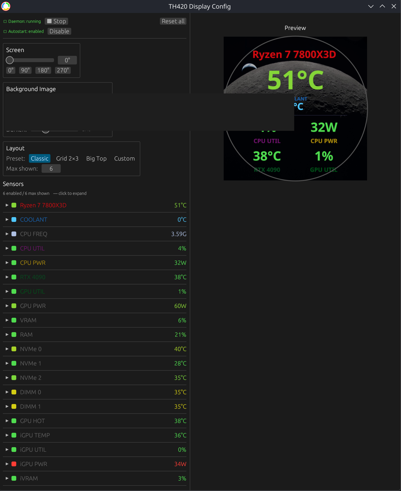
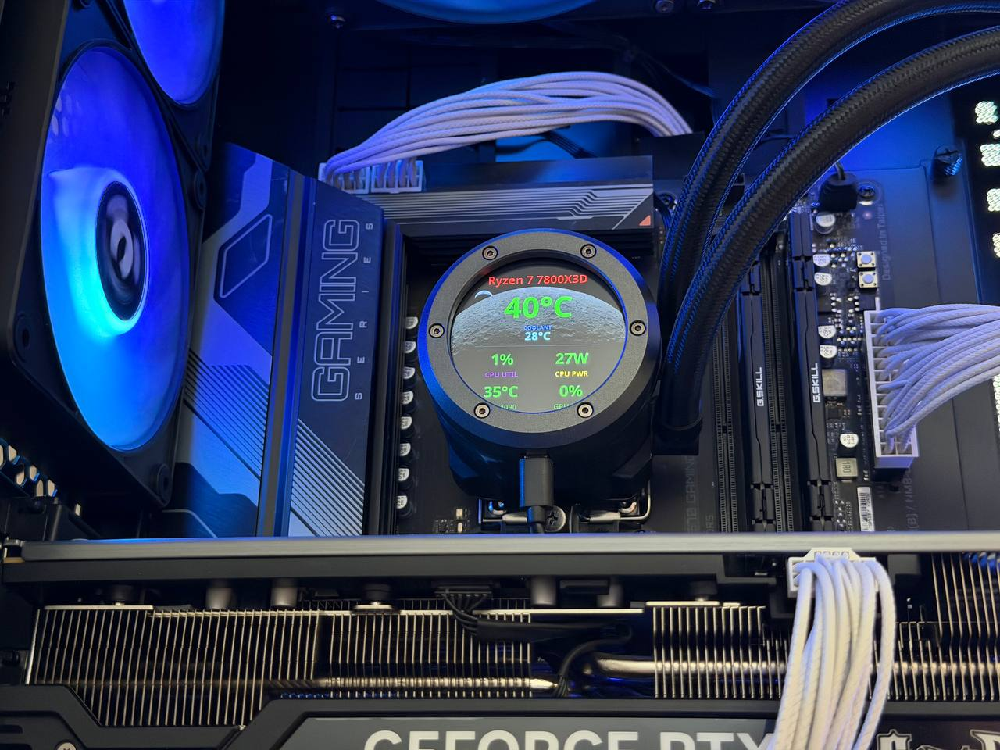
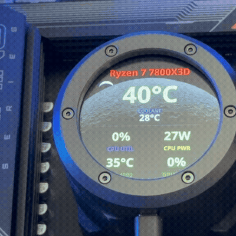

# th420-display

Linux driver + GUI configurator for the **Thermaltake TH420 V2 Ultra EX ARGB** built-in 2.1″ round TFT LCD (480×480).

No official Linux driver exists — protocol fully reverse-engineered without Windows.

---

## Screenshots

> **Note:** The GUI preview shows all sensors except coolant temperature — the AIO pump must be connected for the coolant reading to appear. After applying settings, coolant temp is correctly rendered on the device screen (see photos below).

### GUI configurator



*The coolant temperature field shows `0°C` here because the device was not connected during this screenshot. It displays correctly on the hardware — see below.*

### Live on hardware (Ryzen 7 7800X3D + AIO cooler)



### Settings applied — live update demo



---

## Quick start (AppImage)

Download the latest `th420-display-*-x86_64.AppImage` from the [Releases](../../releases) page, then:

```bash
# 1. Install udev rules — one time, needs sudo
sudo ./install-udev.sh

# 2. Make executable
chmod +x th420-display-*.AppImage

# 3a. Run directly
./th420-display-*.AppImage

# 3b. Or add to the application menu (KDE / Bazzite)
mkdir -p ~/Applications
mv th420-display-*.AppImage ~/Applications/
# Then open gear-lever and register the AppImage — it creates the .desktop entry automatically.
# Alternatively, KDE Plasma 6 will offer to integrate it when you first run it from Dolphin.
```

The GUI handles daemon start/stop and chooses systemd user services or the
installed runit service automatically from PID 1. Unsupported init systems keep
direct daemon controls but do not offer automatic service/autostart management.

---

## Build from source

**Requirements:** Rust toolchain, `hidapi` headers (`libhidapi-dev` / `hidapi-devel`)

```bash
# Daemon only
cargo build --release

# Daemon + GUI configurator
cargo build --release --features gui

# AppImage (downloads appimagetool automatically)
make appimage
```

---

## Platform

| | |
|---|---|
| **OS** | Linux (Bazzite / Fedora, tested on KDE Plasma Wayland) |
| **CPU** | AMD Ryzen 7 7800X3D with `k10temp` + `zenergy` kernel modules |
| **GPU** | NVIDIA RTX 4090 (NVML, driver 595+); AMD Radeon 740M iGPU (`amdgpu`) |
| **Device** | USB HID — VID `264a` / PID `233c` |

---

## Binaries

| Binary | Role |
|---|---|
| `th420-display` | Daemon — reads sensors, renders and pushes frames to the device in a loop |
| `th420-config` | GUI configurator — live preview, color thresholds, daemon control |

---

## GUI features

- **Daemon control** — start / stop with one click; status shown live
- **Autostart** — enable / disable the detected systemd user service or runit service
- **Screen rotation** — slider + quick 0° / 90° / 180° / 270° buttons
- **Background image** — browse for any PNG/JPG, choose Cover / Contain / Stretch fit and darken level
- **Layout presets** — Classic, Grid 2×3, Big Top, Custom (with per-sensor position and font size)
- **Per-sensor config** — enable/disable, custom label, label color, value color gradient with thresholds
- **Live preview** — 480×480 preview updates every 800 ms with real sensor values
- **Config hot-reload** — daemon picks up changes instantly on every save

---

## Sensors

### CPU

| ID | Label | Source |
|---|---|---|
| `cpu_temp` | CPU TEMP | `k10temp` → `Tctl` |
| `cpu_freq` | CPU FREQ | avg `scaling_cur_freq` across all cores |
| `cpu_util` | CPU UTIL | `/proc/stat` delta |
| `cpu_power` | CPU PWR | `zenergy` → `Esocket0` (µJ delta / Δt) |

### Cooling

| ID | Label | Source |
|---|---|---|
| `coolant` | COOLANT | HID command `0x80` on ctrl interface |

### Discrete GPU (NVIDIA via NVML / AMD via sysfs)

| ID | Label | Source |
|---|---|---|
| `gpu_temp` | GPU TEMP | NVML `TemperatureSensor::Gpu` · AMD: `amdgpu` edge |
| `gpu_hotspot_temp` | GPU HOT | NVML `nvmlDeviceGetThermalSettings` → T.Limit |
| `gpu_util` | GPU UTIL | NVML `utilization_rates` · AMD: `gpu_busy_percent` |
| `gpu_power` | GPU PWR | NVML `power_usage` (mW→W) · AMD: `power1_input` |
| `gpu_vram_pct` | VRAM | NVML `memory_info` · AMD: `mem_info_vram_*` |

### Integrated GPU (AMD iGPU via sysfs — visible alongside discrete GPU)

| ID | Label | Source |
|---|---|---|
| `igpu_temp` | iGPU TEMP | `amdgpu` hwmon `temp1_input` |
| `igpu_util` | iGPU UTIL | `amdgpu` → `gpu_busy_percent` |
| `igpu_power` | iGPU PWR | `amdgpu` → `power1_input` |
| `igpu_vram_pct` | iVRAM | `amdgpu` → `mem_info_vram_*` |

### Memory & Storage

| ID | Label | Source |
|---|---|---|
| `ram_used_pct` | RAM | `/proc/meminfo` |
| `nvme0_temp` … `nvme2_temp` | NVMe 0–2 | `nvme` hwmon |
| `dimm0_temp` / `dimm1_temp` | DIMM 0–1 | `spd5118` hwmon |

The first 6 sensors (`cpu_temp`, `coolant`, `cpu_freq`, `cpu_util`, `cpu_power`, `gpu_temp`) are enabled by default; all others are available but off.

**GPU auto-detection:** if NVML initialises successfully (NVIDIA driver present), the discrete GPU occupies the `gpu_*` keys and the `igpu_*` keys carry the AMD integrated graphics independently. On AMD-only systems the iGPU is promoted to `gpu_*` automatically — existing configs require no changes.

**Config migration:** on first launch after an upgrade, any sensors added since the config was created are appended automatically (disabled, preserving all existing customisations).

---

## Config

Path: `~/.config/th420-display/config.toml`

The daemon hot-reloads the config on every file modification. The GUI writes changes
immediately — no manual save step needed.

---

## Persistent LCD media

The `th420-display` CLI can also configure the LCD's persistent media and
standby controls. These commands write device flash; do not combine them with
the normal monitoring daemon.

```bash
# Store a 480x480 standby picture (input images are resized automatically)
th420-display --upload-standby picture.png

# Upload a standby picture while committing pump-temperature text colour and brightness
th420-display --upload-standby picture.png \
  --pump-temp-color '#0000ff' --standby-brightness 80

# Set persistent screen brightness without replacing the standby picture
th420-display --standby-brightness 60

# Store a boot animation from an animated GIF
th420-display --upload-boot animation.gif

# Play one or more transient live frames, or a GIF using its own timing
th420-display --play-live-frames frame-01.png frame-02.png --live-fps 24
th420-display --play-live-gif animation.gif
```

Standby input is converted to a 480x480 JPEG. Boot GIF frames are resized to
480x480 and encoded into the device's persistent boot format. Boot GIFs must
have one uniform, integral frame delay of at least 80 ms; the project also
enforces a conservative 5 MiB container limit. The boot and standby uploads,
including persistence across a physical reconnect, have been verified on
hardware.

For the full command reference, run `th420-display --help`.

---

## Device protocol

For the full capture-based reverse-engineering reference, including persistent
standby media, overlay settings, brightness, live JPEG streaming, and the
hardware-tested boot-animation format, see [docs/PROTOCOL.md](docs/PROTOCOL.md).

Two HID interfaces detected by packet size:

| Interface | Packet | Role |
|---|---|---|
| **ctrl** | 440 bytes | Init handshake, frame-start, sensor queries |
| **image** | 1024 bytes | JPEG chunks (1020-byte payload + 4-byte header) |

**Frame:** JPEG split into 1020-byte chunks, each prefixed with `[0x08, idx, 0x00, 0x80/0x00]`.  
**Keep-alive:** frame re-sent every ~800 ms.  
**Coolant temp:** write `0x80 0x01 0x00 0x80` to ctrl; response bytes 4--5 are
redundant integer encodings: `byte[4] - 0x24` gives °C.

---

## Autostart (manual)

The GUI "Enable autostart" button does this automatically. To do it by hand:

```bash
# Service file is written by the GUI; or create it manually:
systemctl --user daemon-reload
systemctl --user enable --now th420-display
```

### runit (Void Linux)

The repository also includes a system runit service. It defaults to the
packaged binary at `/usr/bin/th420-display`. Install it and enable it with:

```bash
sudo install -Dm755 runit/th420-display/run /etc/sv/th420-display/run
sudo install -Dm644 runit/th420-display/conf.example /etc/sv/th420-display/conf
sudo ln -s /etc/sv/th420-display /var/service/th420-display
```

Because runit services are system services, the daemon otherwise uses root's
default configuration path. Edit `/etc/sv/th420-display/conf` to set
`TH420_DISPLAY_CONFIG` to the configuration file that should drive the display,
or `TH420_DISPLAY_BIN` for a non-packaged binary. Remove the `/var/service/`
symlink to stop and disable the service.

---

## Development

```bash
cargo test                   # 59 daemon unit tests; no hardware required
cargo test --features gui    # daemon suite plus 15 headless GUI tests (74 distinct tests)
```

The hermetic suite covers configuration migration and layouts, rendering,
sensor-data parsing, media encoding, CLI validation, and device packet
framing. It does not replace hardware integration testing: HID discovery and
transport acknowledgements, NVML/system sensor discovery, and interactive GUI
flows still require a compatible running system and physical device.

---

## Notes

- **Personal project** — built for personal use on a specific hardware setup. No ongoing support, issue tracking, or compatibility guarantees are planned.
- **Developed with [Claude](https://claude.ai) and [ChatGPT](https://chatgpt.com/)** — protocol reverse-engineering, driver implementation, GUI, and tooling were developed in assisted pair-programming sessions.
